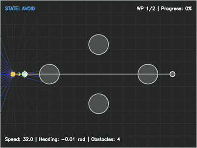
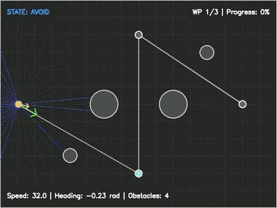

# Autonomous Navigation Agent

> 2D navigation simulator using Artificial Potential Fields, PID heading control, and simulated range sensors

A Python-based autonomous navigation system that simulates intelligent obstacle avoidance in a 2D world. The agent uses APF (Artificial Potential Fields) for reactive path planning, a PID controller for heading tracking, and ray-cast range sensors for obstacle detection. Designed as a DTU MSc Autonomous Systems portfolio project demonstrating real algorithms from the autonomous systems literature.

## Demo

<p align="center">
  
  &nbsp;&nbsp;
  
</p>

<p align="center">
  <em>Left: Gauntlet — slalom through static obstacles. Right: Dynamic — evading moving obstacles.</em>
</p>

## Key Algorithms

- **Artificial Potential Fields** -- Linear repulsive forces with vortex circulation for smooth obstacle avoidance
- **PID Heading Controller** -- Anti-windup integral clamping with derivative filtering
- **Ray-Cast Range Sensor** -- Simulated LIDAR with configurable FOV, ray count, and Gaussian noise
- **Waypoint Navigation** -- Goal sequencing with automatic advancement

## Quick Start

```bash
# Setup
python -m venv venv
source venv/bin/activate
pip install -r requirements.txt

# Run a scenario
python -m src.main --scenario corridor -o output/corridor.mp4

# Evaluate all 8 scenarios (headless, terminal table)
python -m src.evaluate
```

### Interactive Demo (Streamlit)

```bash
pip install -r requirements-streamlit.txt
streamlit run streamlit_app/app.py
```

Pick a preset scenario or build a custom one with click-to-place obstacles and waypoints. Tune APF parameters via sliders and watch the simulation play back as video with metrics.

### Docker

```bash
docker build -t as-nav-agent .
docker run --rm -v $(pwd)/output:/app/output as-nav-agent

# Override default command
docker run --rm -v $(pwd)/output:/app/output as-nav-agent \
    python -m src.main --scenario corridor -o output/corridor.mp4
```

## Scenarios

| Scenario | Description |
|----------|-------------|
| `corridor` | Narrowing passage between wall obstacles |
| `gauntlet` | Slalom through center blockers and flanking obstacles |
| `dynamic` | Moving obstacles crossing the agent's path |
| `slalom` | S-curve through alternating left/right obstacles |
| `narrow_gap` | Precision navigation through a wall opening |
| `u_turn` | Detour around a large central obstacle |
| `crossing` | Dynamic obstacles crossing the agent's path |
| `dense` | Forest of scattered small obstacles |

```bash
# Named scenario
python -m src.main --scenario gauntlet -o output/gauntlet.mp4

# Random with reproducible seed
python -m src.main --scenario random --seed 42 -o output/random.mp4

# Custom duration
python -m src.main --scenario corridor --duration 30 -o output/long.mp4
```

## Evaluation

```bash
# Evaluate all 8 named scenarios (terminal table)
python -m src.evaluate

# With matplotlib plots (bar chart, trajectory overlays, radar chart)
python -m src.evaluate --plots

# Add 20 random scenarios
python -m src.evaluate --random 20

# Single scenario
python -m src.evaluate --scenario corridor
```

## Algorithm Details

### APF Planner

The planner uses **linear repulsion** instead of the classical Khatib 1/d² formulation:

```
F_rep = k_rep * (1 - d / d_0)   for d < d_0
F_rep = 0                        for d >= d_0
```

The classical formulation concentrates 99% of force within a few units of the obstacle surface, making it unusable for navigation at practical distances. Linear repulsion provides meaningful deflection across the full influence range.

**Vortex field**: The repulsive force is rotated 90° toward the goal side, then blended 70% tangential / 30% radial. This prevents head-on deadlocks where attractive and repulsive forces cancel.

**Adaptive EMA smoothing**: The smoothing factor scales with proximity — near obstacles, 95% of the previous frame is retained (preventing oscillation); far from obstacles, standard 70% smoothing applies.

**Speed control**: Sqrt deceleration (`speed = cruise * sqrt(d / d_slow)`) retains ~71% speed at half the slow-down distance, avoiding the sluggishness of linear deceleration. A minimum speed floor of 15.0 u/s prevents stalling.

**Symmetry breaking**: When opposing repulsive forces cancel (net/sum ratio < 0.3), a clockwise perpendicular nudge force is applied to break the deadlock.

### PID Heading Controller

Standard PID with anti-windup integral clamping and configurable max angular velocity. Tracks the desired heading output from the APF planner.

### Coordinate Convention

All code uses radians with y-up (standard math convention). Only the visualization module converts to y-down for OpenCV rendering.

## Architecture

```
Simulation Loop (each time step):
  env.step(dt)              -- advance dynamic obstacles
  navigator.check_and_advance()  -- auto-advance waypoints
  sensor.scan()             -- ray-cast range readings
  planner.compute()         -- APF forces + state classification
  planner.compute_speed()   -- proximity-based speed control
  controller.update()       -- PID heading control + kinematics
  collision response        -- push-out with velocity preservation
  visualization + render    -- draw frame to video
```

| Module | Purpose |
|--------|---------|
| `src/environment.py` | 2D world with circular obstacles and boundary walls |
| `src/sensors.py` | Ray-casting range sensor with noise |
| `src/apf_planner.py` | APF planner: linear repulsion, vortex field, adaptive EMA, symmetry breaking |
| `src/pid_controller.py` | PID heading controller with anti-windup |
| `src/control.py` | Agent controller: PID + kinematics |
| `src/visualization.py` | Frame renderer with world-to-screen transform |
| `src/waypoint_navigator.py` | Goal sequencing |
| `src/main.py` | CLI entry point and simulation orchestration |
| `src/evaluation.py` | Metrics computation and plotting |
| `src/evaluate.py` | Batch evaluation CLI |

## Project Structure

```
as-nav-agent/
├── src/
│   ├── main.py              # Simulation loop + CLI
│   ├── evaluate.py          # Batch evaluation CLI
│   ├── evaluation.py         # Metrics, plotting
│   ├── config.py            # YAML config loading
│   ├── models.py            # Data models (State, AgentState, Obstacle, etc.)
│   ├── environment.py       # 2D world with obstacles
│   ├── sensors.py           # Ray-casting range sensor
│   ├── apf_planner.py       # Artificial Potential Fields planner
│   ├── pid_controller.py    # PID heading controller
│   ├── control.py           # Agent controller (PID + kinematics)
│   ├── visualization.py     # Frame renderer
│   ├── waypoint_navigator.py # Waypoint sequencing
│   └── utils/
│       ├── logger.py        # Structured logging
│       ├── math_utils.py    # Core math functions
│       └── video_utils.py   # Video I/O
├── config/
│   └── default_config.yaml  # Default configuration
├── tests/
│   ├── unit/                # Unit tests per module
│   └── integration/         # Pipeline + behavioral tests
├── Dockerfile               # Reproducible execution
└── requirements.txt
```

## Testing

```bash
pytest                                    # run all tests (453 passing)
pytest --cov=src --cov-report=term-missing  # with coverage
pytest tests/integration/test_behavioral.py  # behavioral acceptance tests only
ruff check src/ tests/                    # linting
mypy src/                                 # type checking
```

## Development

```bash
# Setup
python -m venv venv
source venv/bin/activate
pip install -r requirements.txt

# Verify
pytest --cov=src --cov-report=term-missing
ruff check src/ tests/
mypy src/
```

## Future Work

- **RRT* path planning** -- Global planner as comparison to reactive APF; displays planned path vs actual trajectory
- **Extended Kalman Filter** -- State estimation fusing noisy sensor readings for better obstacle position estimates
- **Multi-agent simulation** -- Multiple agents with mutual repulsive forces for inter-agent collision avoidance
- **Interactive demo** -- Streamlit web interface with adjustable APF/PID parameters via sliders
- **Agent behavior profiles** -- Configurable navigation personalities (drone, ground robot, wall-follower) via heading-aware force attenuation

## License

MIT
